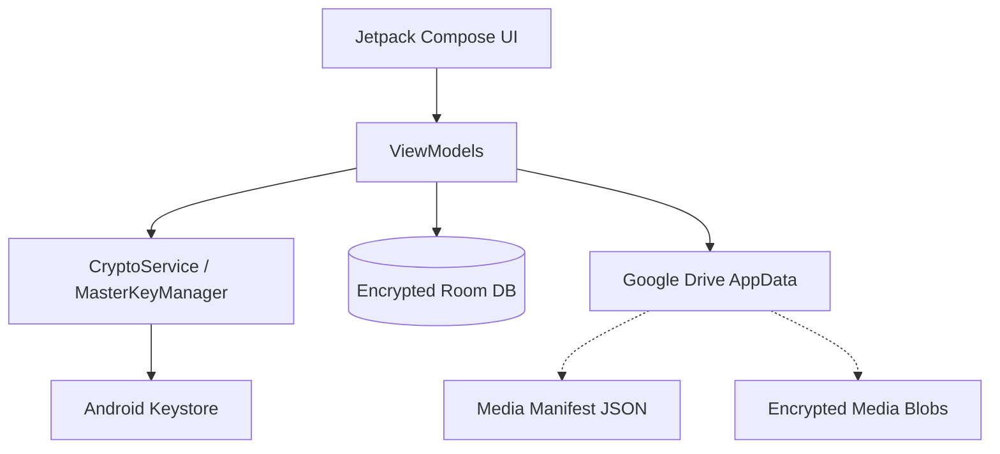

# Vault Android 🔒

Vault is a privacy-first, secure mobile application designed for local-first storage and decentralized cloud recovery. It provides a robust virtual environment for managing sensitive passwords and media, ensuring that your data remains entirely within your control.

## 🎯 Project Objective

The primary objective of Vault is to bridge the gap between high-security hardware-backed encryption and convenient cloud availability. 

Vault aims to provide:
- **Zero-Knowledge Privacy**: Your data is encrypted locally using the industrial-standard AES-256-GCM.
- **Hardware Security**: Core keys are stored in the hardware-backed Android Keystore, inaccessible to other apps.
- **Scalable Backups**: A "Virtual Vault" system for media that allows for efficient, blob-based cloud synchronization via Google Drive's hidden App Data folder.
- **Biometric Armor**: Integrated fingerprint and face unlock that directly interacts with the secure encryption context.

---

## 🏗 Architecture Overview

Vault follows an **MVVM (Model-View-ViewModel)** architectural pattern. The system is designed to isolate sensitive cryptographic operations from the UI while maintaining a reactive, modern user experience.

### Technical Stack
- **UI & UX**: Jetpack Compose (Modern, Reactive UI)
- **Dependency Injection**: Hilt (Dagger-based DI)
- **Local Database**: Room with SQLCipher (Encrypted SQLite)
- **Cloud Backend**: Google Drive API (App Data storage)
- **Security**: Android Keystore, Biometric Prompt API, PBKDF2 Key Derivation.

### Architecture Diagram

### System Workflow (Mermaid)

---

## 🚶 Feature Walkthrough

### 1. Hybrid Master Key Security
Vault uses a unique two-factor setup logic. On first launch, you create a **Master Password**. The app derives a local hardware key and stores a securely encrypted recovery blob on your Google Drive. This ensures that even if you lose your phone, your vault is recoverable as long as you remember your password.

### 2. Media Virtual Vault
Unlike primitive backup systems, Vault uses a **Manifest-based system**. Every photo and video is stored as an individual encrypted blob. The `media_manifest.enc` tracks all files. 
- **Efficiency**: Only changed files are uploaded.
- **Privacy**: File names and metadata are hidden inside the encrypted manifest.

### 3. Biometric Integration
Security doesn't have to be a chore. Vault integrates the Biometric Prompt API such that a successful fingerprint scan can unlock the cryptographic context for the entire application session.

### 4. Zero-Knowledge "Nuke" Flow
Forgotten your password? To maintain a zero-knowledge architecture, Vault does not store your password on any server. If lost, you can initiate a **Full Reset**. This flow securely wipes both your local device and your private Google Drive App Data folder, ensuring a fresh start with zero stale data.

---

## 🚀 Getting Started

### Prerequisites
- **Android Studio** (Ladybug or newer recommended)
- **JDK 17+**
- **Android SDK 26+**

### Local Setup
1. Clone the repository.
2. Open in Android Studio.
3. Configure your `local.properties` or standard Google Services if using additional cloud features.
4. Build and Run on a physical device to test biometric features.

---

## 🧪 Verification & Stability
The project has undergone rigorous testing for:
- **Decryption Integrity**: Verified stable through multiple reset-and-restore cycles.
- **Cloud Consistency**: Instant synchronization of backup status icons.
- **UI Performance**: Smooth grid rendering even with large media manifests.
