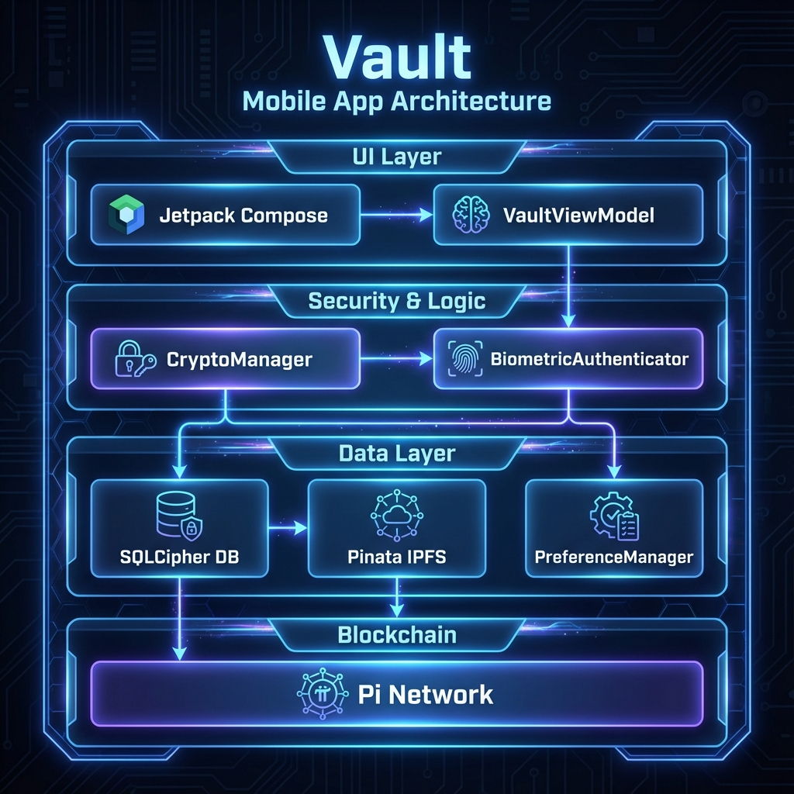

# Vault Android App

Secure, decentralized password manager for Android with blockchain-based rewards and IPFS cloud backups.

## 🏗 Architecture Overview

The app follows the **MVVM (Model-View-ViewModel)** architectural pattern with a clear separation of concerns, utilizing Jetpack Compose for the UI layer and Hilt for dependency injection.



## 🚀 Setup Instructions

Follow these steps to initialize and run the project locally:

1.  **Prerequisites**:
    *   **Android Studio**: Iguana (2023.2.1) or later recommended.
    *   **JDK**: Version 17 or higher.
    *   **Android SDK**: API level 26 (Android 8.0) or higher.

2.  **Clone the Repository**:
    ```bash
    git clone https://github.com/your-repo/vault-android-app.git
    cd vault-android-app
    ```

3.  **API Keys Configuration**:
    *   Open `app/src/main/java/io/vault/mobile/data/remote/PinataApi.kt` and ensure the base URL is correct.
    *   Provide your Pinata JWT token or API keys (standard practice is to use `local.properties` or `BuildConfig`, but ensure the `BackupRepository` is correctly configured).

4.  **Firebase Setup** (Optional):
    *   Place your `google-services.json` in the `app/` directory if you plan to use Firebase services (not required for core functionality).

5.  **Build & Run**:
    *   Open the project in Android Studio.
    *   Sync Gradle and click the **Run** button.
    *   Select a physical device or emulator (API 26+).

## 🧩 Key Component Walkthrough

### 🔒 Security & Data
*   **[CryptoManager](file:///d:/Anti%20Gravity%20Projects/Vault%20Android%20app/app/src/main/java/io/vault/mobile/security/CryptoManager.kt)**: Handles AES-256-GCM encryption/decryption of sensitive password data using the Android KeyStore.
*   **[BiometricAuthenticator](file:///d:/Anti%20Gravity%20Projects/Vault%20Android%20app/app/src/main/java/io/vault/mobile/security/BiometricAuthenticator.kt)**: Manages fingerprint and face unlock prompts for secure access.
*   **[AppDatabase](file:///d:/Anti%20Gravity%20Projects/Vault%20Android%20app/app/src/main/java/io/vault/mobile/data/local/AppDatabase.kt)**: Uses Room with **SQLCipher** for encrypted local storage.

### 🌐 Cloud & Blockchain
*   **[BackupManager](file:///d:/Anti%20Gravity%20Projects/Vault%20Android%20app/app/src/main/java/io/vault/mobile/data/backup/BackupManager.kt)**: Orchestrates the process of encrypting data and uploading it to **IPFS** via the Pinata API.
*   **[RewardManager](file:///d:/Anti%20Gravity%20Projects/Vault%20Android%20app/app/src/main/java/io/vault/mobile/blockchain/RewardManager.kt)**: Integrates with the Pi Network to reward users for maintaining their vault.

### 📱 UI Layer
*   **[VaultNavigation](file:///d:/Anti%20Gravity%20Projects/Vault%20Android%20app/app/src/main/java/io/vault/mobile/ui/navigation/VaultNavigation.kt)**: Manages the Composable-based navigation graph for the app.
*   **[VaultViewModel](file:///d:/Anti%20Gravity%20Projects/Vault%20Android%20app/app/src/main/java/io/vault/mobile/ui/viewmodel/VaultViewModel.kt)**: The central hub for state management, connecting UI screens with underlying data and security services.

## ✨ Features

*   **AES-256-GCM** encryption for all passwords.
*   **Pi Network** blockchain rewards system.
*   **IPFS** decentralized backup via Pinata.
*   **Jetpack Compose** futuristic, neon-themed UI.
*   **Auto-lock** and Biometric authentication.
